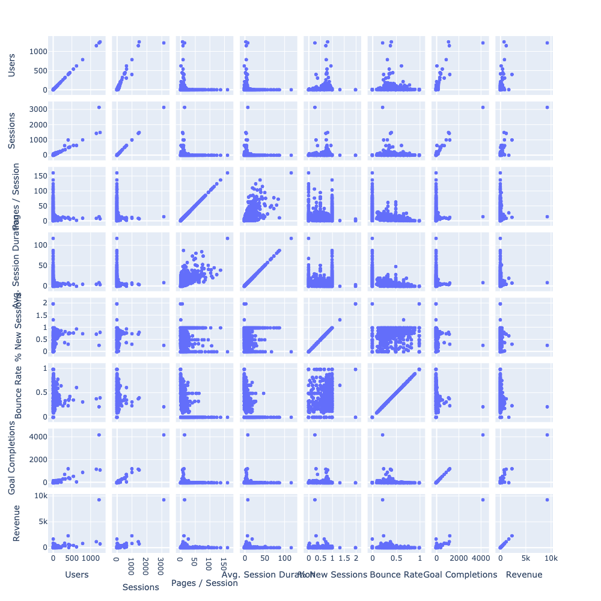
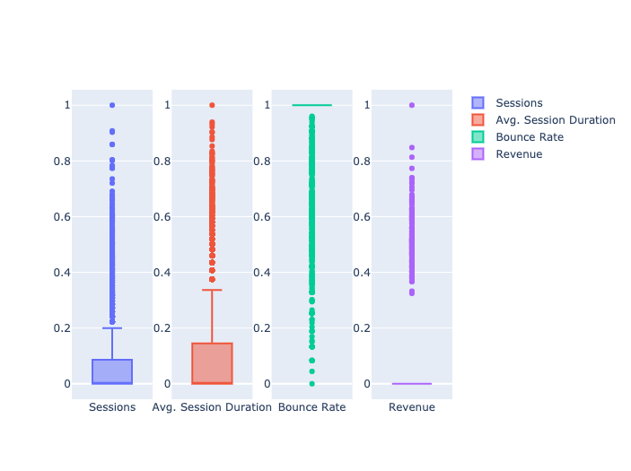
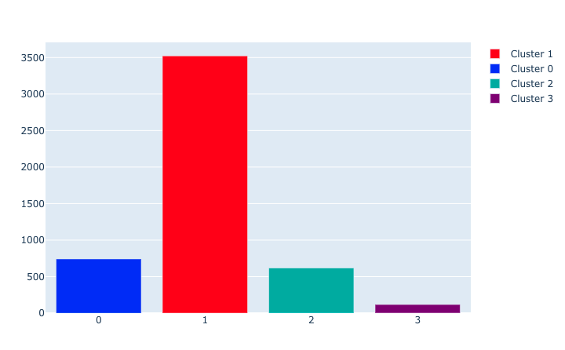
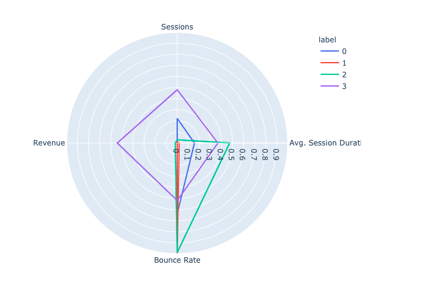
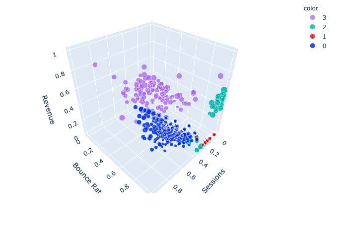
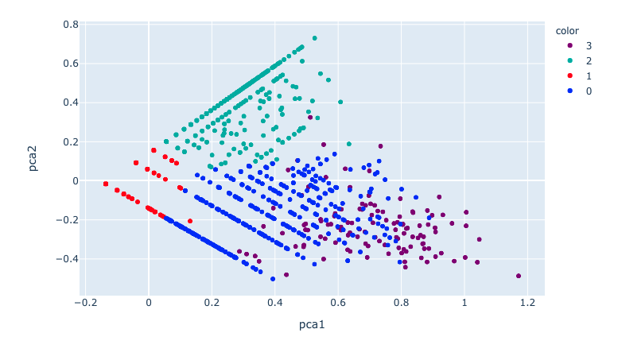

# Google Ads Search Queries Clustering - Project Overview

## Motivation

The objective of the project is to find the best clustering models for Pay Per Click Search Query extracted from Google Analytics.
Once each Query click costs money, clustering and labeling the search queries using information about user behavior and ecommerce metrics will give us valuable insights that could reduce the cost of the campaign, allocating the budget better to improve the results.
More than have a good score, here we are going to look for meaningful cluster labels.

## Overview

* Tested 4 different cluster algorithms to choose and label the search queries with the most meaningful cluster model to help online businesses reduce costs in their campaigns.
* The data was exported from Google Analytics.
* Preprocessed the data before de modeling analyzing the correlation of the features and normalizing them.  
* Specified the number of clusters using silhouette score for each of the cluster algos. 
* Was tested the following cluster algos: K Means, Spectral Clustering, Agglomerative Clustering, Gaussian Mixture.
 

## Resources Used
 **Python Version**: 3.7 
 **Packages**: pandas, numpy, ploty, sklearn 
## Data Cleaning and Preprocessing 
The data imported from Google Analytics are complete and no columns have null values. So, the unique cleaning process required is to set the numbers as float or int. 
Before applying the ML cluster models in our data set, I needed to choose the best features and preprocess the data.
 To choose the features, I analyzed the correlation of the features using the .corr() method and scatter plot.

 

 

After dropping the most correlated ones I ended with the 4 following features.

Sessions
AVG. Session Duration 
Bounce Rate 
Revenue

To make it easy for the algorithms to identify the clusters and minimize the effect of outliers and noise in the data, I transformed to normal distribution. For that, I used NumPy log and after that, I used the sklearn preprocessing package to scale the data.

 

 

## Cluster algorithms

K Means, Spectral Clustering, Agglomerative Clustering, and Gaussian Mixture required a specified number of clusters. To choose the number of clusters in the project I used the Silhouette Score method. After setting the number of clusters I did an analysis plotting the clusters in a few different ways for each of the 4 algorithms.

### Size - Bar Plot 
I use go.Bar to visualize the size of the labels 

 

 

### Mean Of The Features - Polar Plot
Linear Polar Plot to understand the feature mean of the labels.

 

 

### 5 Features Representation - 3D Plot

To plot all features in one single chart, I used the px.scatter_3d. 

 

 

### Principal Component Analysis (PCA)
For a bidimensional visualization, I used the Principal Component Analysis (PCA)

 

 

## Conclusion 

The clusters identified for the algorithm are very consistent in saying that there are 4 groups of queries.
* Queries with rejection - SQ_Rejection.
* Queries that bring buyers - SQ_Buyer.
* Queries that bring interested users - SQ_Intereste.
* Queries that bring a lot of sessions of minimally interested users. - SQ_Sessions_Minimally_Interested.

however, I choose the **Gaussian Mixture** for some reason. 

* **SQ_Buyer-GM** - Shows the higher revenue and this cluster also was unique that created a group with all buyers in only one label.
* **SQ_Intereste_User-GM** - Shows the smaller Avg. Session Duration and the Higher Bounce rate, however, the amount is good enough once the Avg. The session Duration means of the df is 2.45. The size of that cluster is larger when compared with the other algorithms too.
* **SQ_Rejection-GM** - Shows the higher Bounce rate and the smaller Avg Session Duration and Session mean per SQ.
* **SQ_Sessions_Minimally_Interested-GM** - Shows the smaller Session mean. However, the Total sessions are higher, also that algorithms have the second higher Avg. Session Duration.
 
With that information, it is possible to set strategies to reduce rejection. It's also possible to bring more sessions to the website and last but not least, improve the revenue by optimizing the budget of the campaigns.
 
 
Author: Erick C. Varela  
Date: 09/01/2020 
